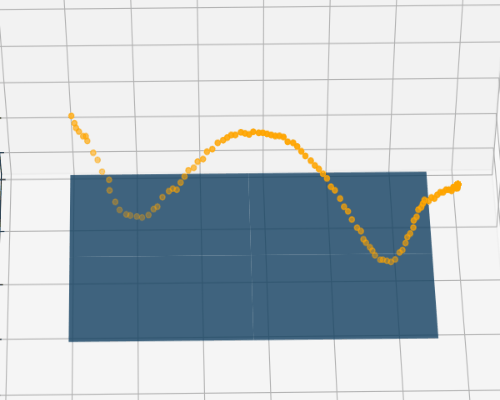

# 個人介紹

---

## 專長

- 深度學習
    - 物件偵測
    - 物件切割
    - 關鍵點偵測

- 影像處理
    - 移動物件處理(幀差法與進階應用)
    - 相機校正(魚眼鏡頭、深度資訊估算)

- 邊緣裝置運算
    - Nvidia Jetson series (Jetson Nano ...)

- 模型輕量化
  - 輕量化模型設計
  - 運用 Nvidia TensorRT 加速
  - 知識蒸餾 (Knowledge distillation)

# 作品集

--- 

我的作品主要以**深度學習在視覺的應用**為主，也有於**強化學習**、**聲音訊號處理**的較小作品， 
以下為作品目錄： 
- ### 1. 運用人工智慧之單相機桌球3D軌跡還原系統 [_快速連結_](1_運用人工智慧之單相機桌球3D軌跡還原系統/README.md)
  - 性質： 大學畢業專題
  - 關鍵字： `深度學習` `影像處理` `相機校正` `3D預測`
  - 預覽圖：
    
    
  

- ### 2. 前視角智慧桌球系統 [>快速連結<](2_前視角智慧桌球系統/README.md)
  - 性質： 碩士論文
  - 關鍵字： `深度學習` `影像處理` `邊緣裝置運算` `幀差累積法`
  
- ### 3. 強化學習之模擬避障 [>快速連結<](3_強化學習之模擬避障/README.md)
  - 性質： 自我學習題目
  - 關鍵字： `強化學習`
  
- ### 4. 音樂歌手辨識 [>快速連結<](4_音樂歌手辨識/README.md)
  - 性質： 大學課程專題
  - 關鍵字： `深度學習` `聲音訊號處理`
  

---

### 快速連結
  - #### [首頁與作品集目錄](README.md)
      - [1. 運用人工智慧之單相機桌球3D軌跡還原系統](1_運用人工智慧之單相機桌球3D軌跡還原系統/README.md)
      - [2. 前視角智慧桌球系統](2_前視角智慧桌球系統/README.md)
      - [3. 強化學習之模擬避障](3_強化學習之模擬避障/README.md)
      - [4. 音樂歌手辨識](4_音樂歌手辨識/README.md)