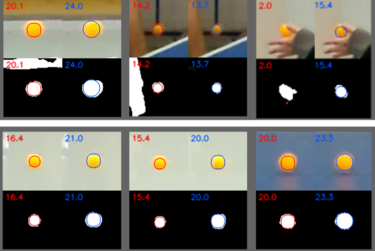

# 運用人工智慧之單相機桌球3D軌跡還原

## 關鍵字： `深度學習` `影像處理` `相機校正` `3D預測`

### 站內連結：
<table>
    <tr>
        <td width="130" align="center">
            <a href="../">首頁與作品預覽</a> 
        </td>
        <td width="130" align="center">
            <a href="../work_1/">桌球3D軌跡 還原系統</a> 
        <td width="130" align="center">
            <a href="../work_2/">前視角智慧 桌球系統</a> 
        </td>
        <td width="130" align="center">
            <a href="../work_3/">強化學習之 模擬避障</a> 
        </td>
        <td width="130" align="center">
            <a href="../work_4/">音樂歌手辨識</a> 
        </td>
    </tr>
</table>

---

## 作品簡介：

> > 此作品為**大學畢業專題**。
> 
> 近年來許多競技運動逐漸加入許多電子系統用以輔佐裁判，其中以視覺系統為一大宗，著名的如「鷹眼系統」用以還原網球軌跡與落球點， 但往往需要多部相機從多角度拍攝，才能重新建構3D軌跡。
> 
> 本作品以單視角(單部攝影機)拍攝，利用幀差法與神經網路，從2D影像追蹤桌球軌跡，再以物件分割方式，取得桌球之面積，用於計算深度資訊，進而重建3D位置。
> 
> ### 系統特色
>  - 以單視角(僅需單部攝影機)還原3D軌跡
>  - 包含**軌跡預測**、**落球點預測**、**計分系統**與**3D軌跡還原**
>  - 可透過GUI圖形使用者介面觀看特定時間點的各式資訊

 

**系統架構：**

此系統包含四大功能，包刮**軌跡預測**、**落球點預測**、**計分系統**與**3D軌跡還原**。

 

**桌球移動路徑追蹤 (gif動圖)：**

透過GUI可以選擇要處理的影片，並會顯示處理過程(包含 **軌跡預測**、**落球點預測** 與 **雙方得分**)。

 

**物件分割結果 (左紅色為傳統影像處理，以HSV閥值進行分割；右藍色為CNN分割模型預測結果)：**

透過卷積神經網路來進行物件分割，找出球體之mask後可以藉由其在畫面中的球體直徑來預估深度資訊(3D位置)。

 

**卷積神經網路模型架構：**

採用 MobileNetV2 作為網路的backbone，提取其中間層輸出，並加上upsample層來達到物件分割的應用。 
(參考自 MobileNetV2: https://arxiv.org/abs/1801.04381)

 

**深度資訊推算：**

透過已知的桌球直徑與球桌尺寸(常見比賽規格)，可推知桌球在不同距離下在畫面上會有固定的直徑長度。 (在此示意圖中，桌球落在靠近相機的桌子邊緣時，直徑應約為28 pixel；
而在較遠的桌子邊緣時，直徑應約為17 pixel)

 

**3D軌跡還原 (gif動圖)：**

經由前述個方法結和，還原出之3D軌跡圖。

 

**系統GUI：**

GUI可以顯示包含2D影像畫面、3D軌跡圖與方便使用者拖拉影片播放的影片時間軸，時間軸上還會標記該段時間所發生的事件，供使用者能夠快速移至特定時間點觀看3D軌跡還原。

 

---

### 快速連結
  - #### [首頁與作品集目錄](../README.md)
      - [1. 運用人工智慧之單相機桌球3D軌跡還原系統](../work_1/README.md)
      - [2. 前視角智慧桌球系統](../work_2/README.md)
      - [3. 強化學習之模擬避障](../work_3/README.md)
      - [4. 音樂歌手辨識](../work_4/README.md)

