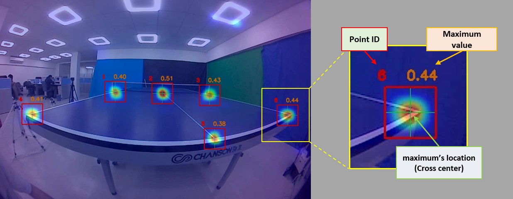
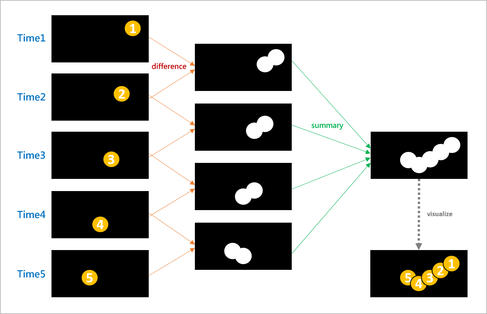
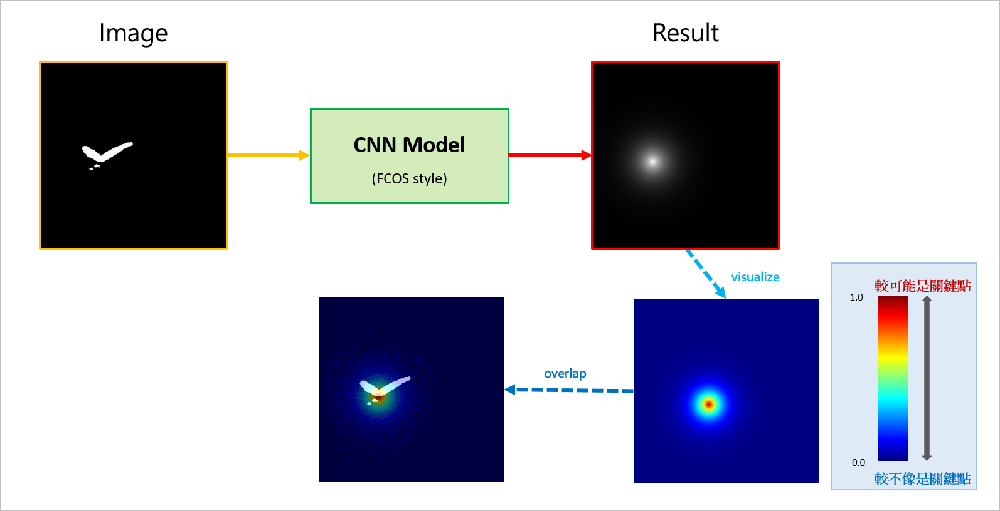
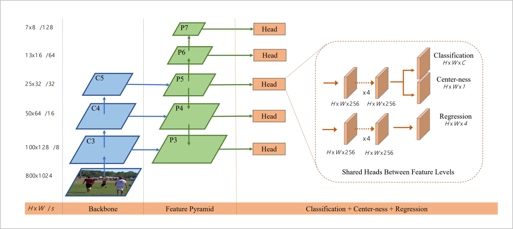
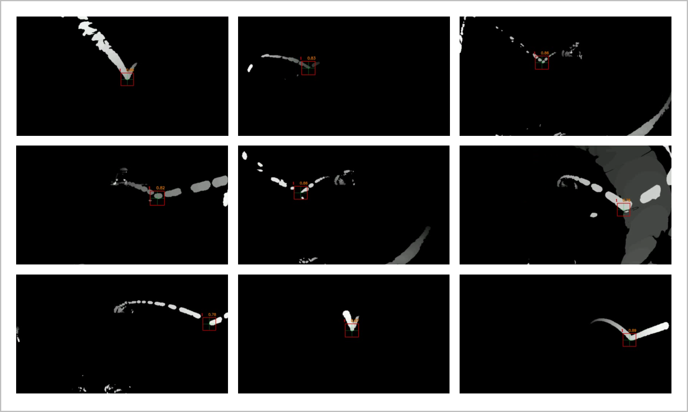

# 前視角智慧桌球系統

## 關鍵字： `深度學習` `影像處理` `邊緣裝置運算` `幀差累積法`

---

### 快速連結
  - #### [首頁與作品集目錄](../README.md)
      - [1. 運用人工智慧之單相機桌球3D軌跡還原系統](../work_1/README.md)
      - [2. 前視角智慧桌球系統](../work_2/README.md)
      - [3. 強化學習之模擬避障](../work_3/README.md)
      - [4. 音樂歌手辨識](../work_4/README.md)
    
---

## 作品簡介：

這裡是簡介

**運行畫面 (左: 原始影像與預測heatmap; 中: 幀差累積圖; 右: 落球位置還原，紅色為最新落球點，橘色為歷史落球點)**

 

**球桌偵測**

 

**幀差累積法**

 

**深度模型預測**

 

**FCOS模型 (引用自: https://arxiv.org/abs/1904.01355)**

 

**更多落球點預測結果**

 

---

### 快速連結
  - #### [首頁與作品集目錄](../README.md)
      - [1. 運用人工智慧之單相機桌球3D軌跡還原系統](../work_1/README.md)
      - [2. 前視角智慧桌球系統](../work_2/README.md)
      - [3. 強化學習之模擬避障](../work_3/README.md)
      - [4. 音樂歌手辨識](../work_4/README.md)