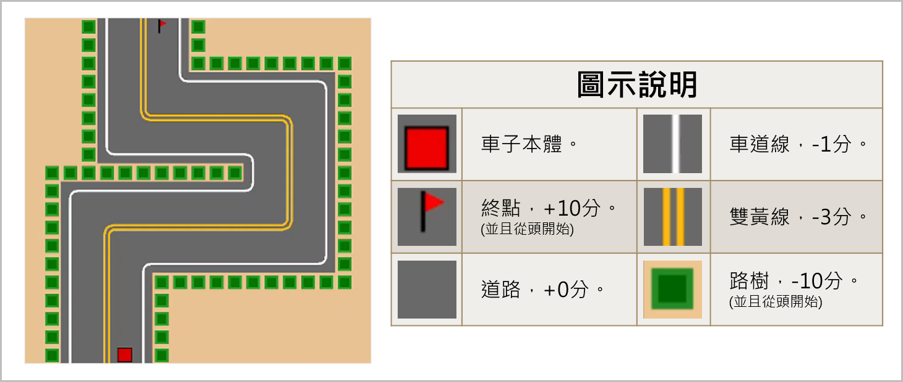

# 強化學習之模擬避障

## 關鍵字： `強化學習`

---

### 站內連結：

<table style="width:1000px">
    <tr>
        <td align="center" width="165px">
            <a href="../">首頁與預覽</a> 
        </td>
        <td align="center" width="165px">
            <a href="../work_1/">桌球3D軌跡 還原系統</a> 
        </td>
        <td align="center" width="165px">
            <a href="../work_2/">前視角智慧 桌球系統</a> 
        </td>
        <td align="center" width="165px">
            <a href="../work_3/"><b>強化學習之 模擬避障</b></a> 
        </td>
        <td align="center" width="165px">
            <a href="../work_4/">音樂歌手辨識</a> 
        </td>
    </tr>
</table>

 

---

## 作品簡介：

> > 此作品為**練習題目**。
> 
> **強化學習**近年來開始被應用在許多領域上，著名系統如「AlphaGo」在圍棋比賽擊敗眾多人類頂尖高手，強化學習也逐漸可能被用於**自駕車領域**。
> 
> 出於練習，我使用最基礎的 Q-learning 設計出一組簡單的虛擬場景來訓練與觀察虛擬車子的學習過程與行為。

 

**圖示與得分機制：**

Q-learning 透過事先定義車子與物件互動後的加扣分，從而督促車子以獲取最高分為目標，而畫面中的每一格都屬於一種物件，以下為車子觸碰到各物件的分數。

 

**不同學習階段的成果展示：**

<table style="width:1000px">
    <tr>
        <td align="center" width="120px">
            <b>學 習 階 段</b> 
        </td>
        <td width="385px">
            <b>描 述 與 說 明</b> 
        </td>
        <td align="center" >
            <b>影 像 展 示 ( gif 動 圖 )</b> 
        </td>
    </tr>
    <tr>
        <td align="center" width="120px">
            學習初期 
        </td>
        <td width="385px">
            車子尚未學習到行動與加扣分的關聯，到處橫衝直撞，漫無目的到處亂跑。 
        </td>
        <td align="center" width="200px">
             
        </td>
    </tr>
    <tr>
        <td align="center">
            學習中期 
        </td>
        <td width="385px">
            車子已學會不要去撞路樹從而避免大量扣分(撞樹-10分)，但還沒有學到前往終點的最佳路徑，在區域內來回徘徊不前。 
        </td>
        <td align="center" width="200px">
             
        </td>
    </tr>
    <tr>
        <td align="center" width="120px">
            學習末期 
        </td>
        <td width="385px">
            車子找到幾近最佳通往終點的路徑，在盡量避免扣分的情況下，以最短路徑前往終點。 
        </td>
        <td align="center">
             
        </td>
    </tr>
</table>

 

---

<table >
    <tr>
        <td align="center" width="120px">
            <a href="#強化學習之模擬避障">回到頂部</a> 
        </td>
    </tr>
</table>