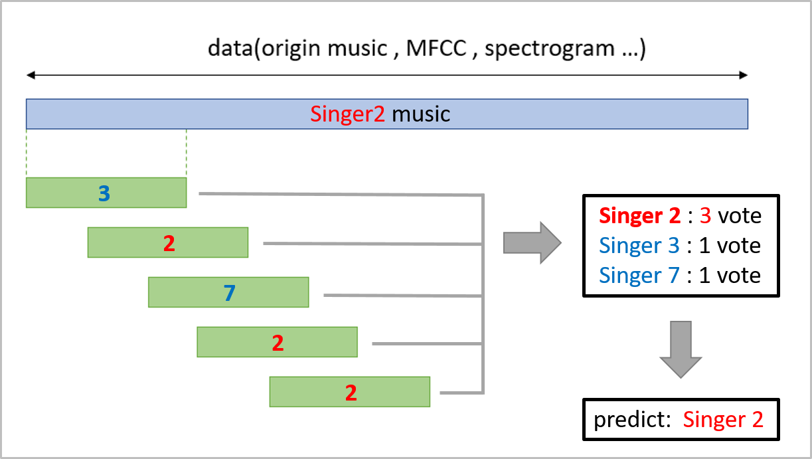

# 音樂歌手辨識 

## 關鍵字： `深度學習` `聲音訊號處理`

---

### 站內連結：

<table style="width:1000px">
    <tr>
        <td align="center" width="165px">
            <a href="../">首頁與預覽</a> 
        </td>
        <td align="center" width="165px">
            <a href="../work_1/">桌球3D軌跡 還原系統</a> 
        </td>
        <td align="center" width="165px">
            <a href="../work_2/">前視角智慧 桌球系統</a> 
        </td>
        <td align="center" width="165px">
            <a href="../work_3/">強化學習之 模擬避障</a> 
        </td>
        <td align="center" width="165px">
            <a href="../work_4/"><b>音樂歌手辨識</b></a> 
        </td>
    </tr>
</table>

 

---

## 作品簡介：

> >此作品為**課程專題**。
> 
> 有別於在資料庫中利用特徵搜尋已存在的歌曲與對應演唱歌手，本作品每位歌手僅有數10首歌曲作為參考資料，需預測不存在資料庫中的**新歌曲為哪位歌手演唱**。

 

**預測流程**

透過將歌曲拆分並轉換為時頻圖(spectrogram)，再以卷積神經網路預測該段歌曲的演唱歌手。

 

**網路模型架構**

利用簡易的卷積神經網路來進行預測，輸入為一張時頻圖，輸出為時頻圖屬於10位歌手的相對應機率。

 

**投票機制**

由於歌曲具有長度不一的特性，因此將歌曲拆分為細小段落，分別預測；最後再綜合結果，以投票方式，將最高票的歌手作為最終預測結果。

 

---

### 快速連結
  - #### [首頁與作品集目錄](../README.md)
      - [1. 運用人工智慧之單相機桌球3D軌跡還原系統](../work_1/README.md)
      - [2. 前視角智慧桌球系統](../work_2/README.md)
      - [3. 強化學習之模擬避障](../work_3/README.md)
      - [4. 音樂歌手辨識](../work_4/README.md)