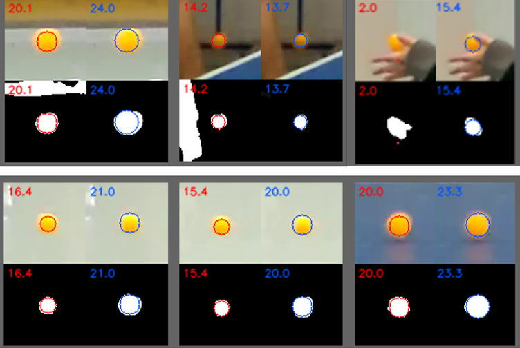
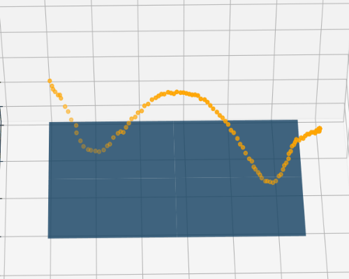

# 作品集 
[點擊這裡回到首頁與目錄](../README.md)

## 1. 運用人工智慧之單相機桌球3D軌跡還原 

### 關鍵字： `深度學習` `影像處理` `相機校正` `3D預測`

### 作品簡介：

近年來許多競技運動逐漸加入許多電子系統用以輔佐裁判，其中以視覺系統為一大宗，著名的如「鷹眼系統」用以還原網球軌跡與落球點， 但往往需要多部相機從多角度拍攝，才能重新建構3D軌跡。 

本作品以單視角(單部相機)拍攝，利用幀差法與神經網路，從2D影像追蹤桌球軌跡，再以物件分割方式，取得桌球之面積，用於計算深度資訊，進而重建3D位置。

**桌球移動路徑追蹤 (gif動圖)：**

**物件分割結果 (左紅色為傳統影像處理，以HSV閥值進行分割、
右藍色為CNN分割模型預測結果)：**

**3D軌跡還原 (gif動圖)：**

---
[點擊這裡回到首頁與目錄](../README.md)
